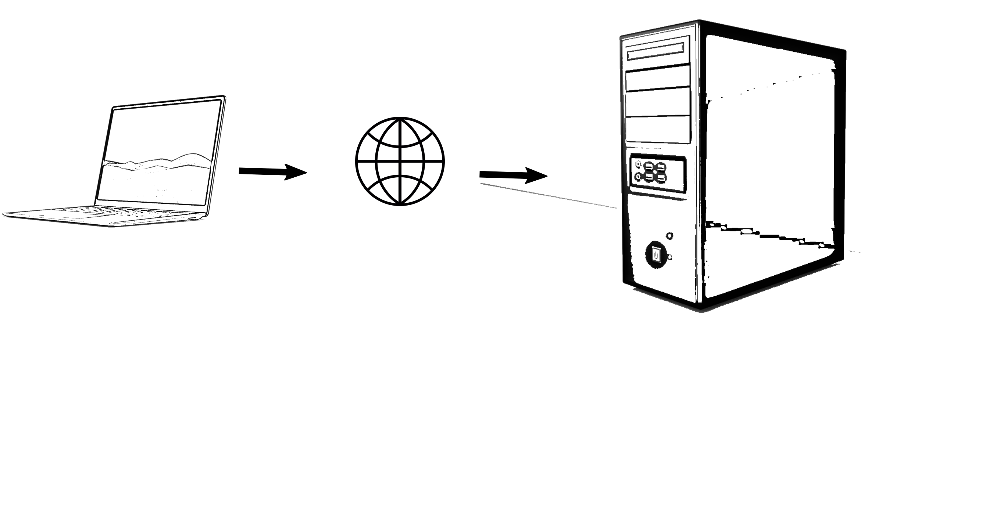

# Guía rápida para el uso del servidor


## Conociendo el sistema GNU/Linux


El tutorial a continuación aporta la información básica para poder conectarse y trabajar de manera remota a un servidor mediante [ssh](https://www.openssh.com/) desde una terminal local, esto significa que se interactuará a travez de interfaz de línea de comandos (CLI *por sus siglas en ingles*), sin interfáz gráfica.


En el presente tutorial se promueve el uso de Jupyter [lab](https://jupyterlab.readthedocs.io/en/stable/), jupyter [notebook](https://ebac.mx/blog/jupyter-notebook), ambas son plataformas informaticas interactictibas basadas en web adoptadas por el proyecto [Jupyter](https://jupyter.org/). Tango lab y notebook se pueden usar como bitácora de trabajo y para compartír codigo, de la misma manera se puede usar a [RStusio](https://posit.co/download/rstudio-desktop/) y [quarto](https://quarto.org/) como bitácora local de jupyter.

[Jupyter](https://jupyter.org/) es un sistema de publicación científica y técnica de código abierto para varios leguajes de programación con licencia BSD, _"libre"_ y _"gratuita"_. [Jupyter](https://jupyter.org/) es también una comunidad de gente entusiasta en manejo de datos que cree en los estándares de educación y herramientas de acceso abierto. Para mayor información, visite la página de de [Jupyter](https://jupyter.org/) en https://jupyter.org/.


## La cadena de conexión



## Organizacion de directorios del sistema en GNU/Linux y gestión de archivos

Los servidores en general, en su mayoría, traen distribuciones GNU/Linux, entonces primero hay que conocer la estructura de directorios de este tipo de distribuciones.

Como se sabe en GNU/Linux las rutas están construidas un poco diferente a como es en Windows, todo empieza desde la raíz (_"root"_) que se escribe con el símbolo <kbd>/</kbd>, dentro del directotio raíz hay varios directorios del sistema acompañado de 1 directorio de usarios de nombre  <kbd>/home</kbd> y dentro del directorio de usuarios está el directorio con los documentos de cada usuario  <kbd>/home/username</kbd>, tal y como se muestra en la imagen a continuación.

*para carpetas*


## mover archivos


### _*mv*_

Primero hay que saber que la acción de  _**mover**_ y _**transferir**_ no son lo mismo, transferir consiste de la gestion de archivos y directorios de un equipo local a uno remoto y viceversa.

El comando _**mv**_ es equivalente a copiar y pegar en una sola acción y en esta única acción hay que definir las rutas completas de origen y destino de los archivos a copiar.

Si escribimos el comando man y la orden cp en la terminal, nos dirá como utilizar. man está disponible para muchos de los programas de bash.


```python
man mv
```


    MV(1)			      Órdenes de usuario			 MV(1)
    
    NOMBRE
           mv - mueve (renombra) archivos
    
    SINOPSIS
           mv [OPCIÓN]... [-T] ORIGEN DESTINO
           mv [OPCIÓN]... ORIGEN... DIRECTORIO
           mv [OPCIÓN]... -t DIRECTORIO ORIGEN...
    
    DESCRIPCIÓN
           Copia ORIGEN a DESTINO, o varios ORIGEN(es) a DIRECTORIO.
    
           Los  argumentos	obligatorios  para  las	 opciones  largas  son también
           obligatorios para las opciones cortas.
    
           --backup[=CONTROL]
    	      crea una copia de seguridad de cada archivo de  destino  que  ya
    	      exista
    
           -b     como --backup pero no acepta ningún argumento
    
           -f, --force
    	      no pregunta nunca antes de sobreescribir
    
           -i, --interactive
    	      pide confirmación antes de sobreescribir
    
           -n, --no-clobber
    	      no sobreescribe un archivo que exista
    
           Si  especifica  más  de	una opción de -i, -f, -n, solo se considera la
           última.
    
           --strip-trailing-slashes
    	      elimina la barra al final de cada argumento de ORIGEN
    
           -S, --suffix=SUFIJO
    	      reemplaza el sufijo de respaldo habitual
    
           -t, --target-directory=DIRECTORIO
    	      mueve todos los argumentos ORIGEN al directorio DIRECTORIO
    
           -T, --no-target-directory
    	      trata DESTINO como archivo normal
    
           -u, --update
    	      mueve solamente cuando el archivo ORIGEN es más moderno  que  el
    	      archivo de destino, o cuando falta el archivo de destino
    
           -v, --verbose
    	      explica lo que va haciendo
    
           -Z, --context
    	      define  el  contexto  de	seguridad  de  SELinux	del archivo de
    	      destino con el tipo por defecto
    
           --help muestra la ayuda y finaliza
    
           --version
    	      muestra la versión del programa y finaliza
    
           El sufijo de respaldo es '~', a menos que se establezca con --suffix  o
           con  SIMPLE_BACKUP_SUFFIX.  El  método  de  control de versión se puede
           seleccionar con la opción --backup o a través de la variable de entorno
           VERSION_CONTROL. Estos son los valores:
    
           none, off
    	      nunca  realiza  copias  de seguridad (incluso si se da la opción
    	      --backup)
    
           numbered, t
    	      crea copias de seguridad numeradas
    
           existing, nil
    	      numeradas si existen copias de seguridad numeradas,  simples  en
    	      caso contrario
    
           simple, never
    	      siempre crea copias de seguridad simples
    
    AUTOR
           Escrito por Mike Parker, David MacKenzie y Jim Meyering.
    
    INFORMAR DE ERRORES
           Ayuda	     en		línea	      de	 GNU	    Coreutils:
           <https://www.gnu.org/software/coreutils/>
           Informe	     cualquier	     error	 de	   traducción	     a
           <https://translationproject.org/team/es.html>
    
    COPYRIGHT
           Copyright  ©  2022  Free Software Foundation, Inc. Licencia GPLv3+: GNU
           GPL versión 3 o posterior <https://gnu.org/licenses/gpl.html>.
           Esto es software libre: usted es libre de cambiarlo  y  redistribuirlo.
           NO HAY GARANTÍA, en la medida permitida por la legislación.
    
    VÉASE TAMBIÉN
           rename(2)
    
           Documentación completa: <https://www.gnu.org/software/coreutils/mv>
           también	puede acceder de forma local ejecutando:  info '(coreutils) mv
           invocation'
    
    TRADUCCIÓN
           La traducción al español de esta	 página	 del  manual  fue  creada  por
           Gerardo	Aburruzaga  García  <gerardo.aburruzaga@uca.es>,  Juan Piernas
           <piernas@ditec.um.es> y Marcos Fouces <marcos@debian.org>
    
           Esta traducción es documentación	 libre;	 lea  la  GNU  General	Public
           License	 Version   3   ⟨https://www.gnu.org/licenses/gpl-3.0.html⟩   o
           posterior con respecto a	 las  condiciones  de  copyright.   No	existe
           NINGUNA RESPONSABILIDAD.
    
           Si  encuentra  algún  error en la traducción de esta página del manual,
           envíe un correo electrónico a ⟨debian-l10n-spanish@lists.debian.org⟩.
    
    GNU coreutils 9.1	      Septiembre de 2022			 MV(1)


### _cp_ 

#### Comando _cp_ aplicado a archivos

*para archivos la sintaxis debe ser como se muestra a continuación*:

<kbd>__cp__</kbd>    <kbd>__ORIGEN__</kbd>    <kbd>__DESTINO__</kbd>


```python
cp /home/rcastro/001_000.jpg /home/rcastro/Imágenes/
```

Si yo ejecuto el comando escrito en la línea anterior, le estaría dando la orden a la terminal de copiar un archivo de la ruta /home/user/ a la ruta /home/user/Imágenes/, al poner el nombre y extension del archivo \*.jpg, sólo en el origen, entonces no se cambiará el nombre del archivo a copiar _001_000.jpg_.

### _cp_

#### Este es el mismo comando mencionado arriba, pero aplicado a directorios

*para diectorios se requiere la opción _"-R"_ que en realidad signfica que el proceso sea reiterativo y la sintaxis debe ser como se muestra a continuación*:

<kbd>__cp__</kbd>    <kbd>__-R__</kbd> <kbd>__ORIGEN__</kbd>    <kbd>__DESTINO__</kbd>


```python
cp -R PATH_ORIGEN PATH_DESTINO # es reiterativo para que copie todo el contenido interno
```

### cd

__Entrar y salir de directorios__

se puede usar *cd ~/*  y la terminal lo enviará a /home/user


```python
cd ~/
```

    /home/rcastro


cd sirve para moverse entre directorios, si ud proporciona la ruta completa, este lo llevará a ella, revise que significa _ruta relativa_ y _ruta absoluta_ para poder tener una idea mas clara del uso del comando cd

La sintaxis es:


```python
cd RUTA_DESTINO
```

para *ir* un nivel arriba escriba:


```python
cd ..
```

para ir a /home/user escriba sólo  "cd"


```python
cd
```

    /home/rcastro


### Ver la ruta de trabajo actual


```python
pwd
```


    '/home/rcastro'


### Ver contenido de una ruta en una lista


cualquier cosa precedida por símbolo de \# es invisible para la terminal, puede usarlo para realizar anotaciones.


```python
ls # ya sea en la ruta actual o en una ruta específica|
```

### Crear y borrar direcotrios y archivos


__Nota: ya sea para copiar o borrar, en caso de los directorios debe usarse -R para que sea reiterativo__


```python
mkdir NOMBRE_DIRECTORIO # Crea un directorio
```


```python
rm -R NOMBRE_DIRECTORIO # Remueven directorio con contenido
```


```python
rm archivo,txt # Remueve un archivo de nombre archivo.txt
```


```python
man ls #llama al manual de cualquier programa, como ls
```

### Otros comandos

Limpiar la terminal, esta tarea puede realizarse mediante
<kbd>Alt</kbd> + <kbd>L</kbd>

o ejecutando en la terminal:


```python
clear
```

    

Estos son algunos de los comandos más comunes en la gestión de archivos y directorios en GNU/Linux


|_Comdando_|Acción|
|------------------|--------------------|
|_ls_|Visualizar listas de directorios y archivos|
|_cd_|Cambiar de directorio|
|_pwd_|Mostrar directorio de trabajo|
|_mkdir_|Crea directorio vacío|
|_rm_|Remover archivos y directorios|
|_cp_|Copiar direcotios o archivos|
|_mv_|Mover o renombrar archivos o directorios|
|_touch_|Crear o actualizar archivo de texto|
|_cat_|Visualizar todo el texto de archivo|
|_more_|Visualizar texto de archivo|
|_less_|Visaulizar texto de archivo |
|_head_|Visaulizar 10 primeras líneas de texto de archivo|
|_tail_|Visaulizar ultimas 10 lineas de texto de archivo|
|_man_|Muestra el manual de los comandos|


## Transferir archivos


Esto básicamente consiste de enviar, archivos de un recurso local a uno remoto.


### _scp_

Este comando, *scp*, requiere del origen y el destino en los equipos local y remoto, estas rutas servirán para gestionar los archivos mediante ssh y scp.

para indicar el manual debemos escribir _man scp_


```python
man scp #nos muestra el manual de scp
```


    SCP(1)                    BSD General Commands Manual                   SCP(1)
    
    NAME
         scp — OpenSSH secure file copy
    
    SYNOPSIS
         scp [-346ABCpqrTv] [-c cipher] [-F ssh_config] [-i identity_file]
             [-J destination] [-l limit] [-o ssh_option] [-P port] [-S program]
             source ... target
    
    DESCRIPTION
         scp copies files between hosts on a network.  It uses ssh(1) for data
         transfer, and uses the same authentication and provides the same security
         as ssh(1).  scp will ask for passwords or passphrases if they are needed
         for authentication.
    
         The source and target may be specified as a local pathname, a remote host
         with optional path in the form [user@]host:[path], or a URI in the form
         scp://[user@]host[:port][/path].  Local file names can be made explicit
         using absolute or relative pathnames to avoid scp treating file names
         containing ‘:’ as host specifiers.
    
         When copying between two remote hosts, if the URI format is used, a port
         may only be specified on the target if the -3 option is used.
    
         The options are as follows:
    
         -3      Copies between two remote hosts are transferred through the local
                 host.  Without this option the data is copied directly between
                 the two remote hosts.  Note that this option disables the
                 progress meter and selects batch mode for the second host, since
                 scp cannot ask for passwords or passphrases for both hosts.
    
         -4      Forces scp to use IPv4 addresses only.
    
         -6      Forces scp to use IPv6 addresses only.
    
         -A      Allows forwarding of ssh-agent(1) to the remote system.  The de‐
                 fault is not to forward an authentication agent.
    
         -B      Selects batch mode (prevents asking for passwords or
                 passphrases).
    
         -C      Compression enable.  Passes the -C flag to ssh(1) to enable com‐
                 pression.
    
         -c cipher
                 Selects the cipher to use for encrypting the data transfer.  This
                 option is directly passed to ssh(1).
    
         -F ssh_config
                 Specifies an alternative per-user configuration file for ssh.
                 This option is directly passed to ssh(1).
    
         -i identity_file
                 Selects the file from which the identity (private key) for public
                 key authentication is read.  This option is directly passed to
                 ssh(1).
    
         -J destination
                 Connect to the target host by first making an scp connection to
                 the jump host described by destination and then establishing a
                 TCP forwarding to the ultimate destination from there.  Multiple
                 jump hops may be specified separated by comma characters.  This
                 is a shortcut to specify a ProxyJump configuration directive.
                 This option is directly passed to ssh(1).
    
         -l limit
                 Limits the used bandwidth, specified in Kbit/s.
    
         -o ssh_option
                 Can be used to pass options to ssh in the format used in
                 ssh_config(5).  This is useful for specifying options for which
                 there is no separate scp command-line flag.  For full details of
                 the options listed below, and their possible values, see
                 ssh_config(5).
    
                       AddressFamily
                       BatchMode
                       BindAddress
                       BindInterface
                       CanonicalDomains
                       CanonicalizeFallbackLocal
                       CanonicalizeHostname
                       CanonicalizeMaxDots
                       CanonicalizePermittedCNAMEs
                       CASignatureAlgorithms
                       CertificateFile
                       ChallengeResponseAuthentication
                       CheckHostIP
                       Ciphers
                       Compression
                       ConnectionAttempts
                       ConnectTimeout
                       ControlMaster
                       ControlPath
                       ControlPersist
                       GlobalKnownHostsFile
                       GSSAPIAuthentication
                       GSSAPIDelegateCredentials
                       HashKnownHosts
                       Host
                       HostbasedAuthentication
                       HostbasedKeyTypes
                       HostKeyAlgorithms
                       HostKeyAlias
                       Hostname
                       IdentitiesOnly
                       IdentityAgent
                       IdentityFile
                       IPQoS
                       KbdInteractiveAuthentication
                       KbdInteractiveDevices
                       KexAlgorithms
                       LogLevel
                       MACs
                       NoHostAuthenticationForLocalhost
                       NumberOfPasswordPrompts
                       PasswordAuthentication
                       PKCS11Provider
                       Port
                       PreferredAuthentications
                       ProxyCommand
                       ProxyJump
                       PubkeyAcceptedKeyTypes
                       PubkeyAuthentication
                       RekeyLimit
                       SendEnv
                       ServerAliveInterval
                       ServerAliveCountMax
                       SetEnv
                       StrictHostKeyChecking
                       TCPKeepAlive
                       UpdateHostKeys
                       User
                       UserKnownHostsFile
                       VerifyHostKeyDNS
    
         -P port
                 Specifies the port to connect to on the remote host.  Note that
                 this option is written with a capital ‘P’, because -p is already
                 reserved for preserving the times and modes of the file.
    
         -p      Preserves modification times, access times, and modes from the
                 original file.
    
         -q      Quiet mode: disables the progress meter as well as warning and
                 diagnostic messages from ssh(1).
    
         -r      Recursively copy entire directories.  Note that scp follows sym‐
                 bolic links encountered in the tree traversal.
    
         -S program
                 Name of program to use for the encrypted connection.  The program
                 must understand ssh(1) options.
    
         -T      Disable strict filename checking.  By default when copying files
                 from a remote host to a local directory scp checks that the re‐
                 ceived filenames match those requested on the command-line to
                 prevent the remote end from sending unexpected or unwanted files.
                 Because of differences in how various operating systems and
                 shells interpret filename wildcards, these checks may cause
                 wanted files to be rejected.  This option disables these checks
                 at the expense of fully trusting that the server will not send
                 unexpected filenames.
    
         -v      Verbose mode.  Causes scp and ssh(1) to print debugging messages
                 about their progress.  This is helpful in debugging connection,
                 authentication, and configuration problems.
    
    EXIT STATUS
         The scp utility exits 0 on success, and >0 if an error occurs.
    
    SEE ALSO
         sftp(1), ssh(1), ssh-add(1), ssh-agent(1), ssh-keygen(1), ssh_config(5),
         sshd(8)
    
    HISTORY
         scp is based on the rcp program in BSD source code from the Regents of
         the University of California.
    
    AUTHORS
         Timo Rinne <tri@iki.fi>
         Tatu Ylonen <ylo@cs.hut.fi>
    
    BSD                             August 3, 2020                             BSD


Dado que un comando tiene cierta sintaxis:
    
    comando <opciones> <parámetro1> <parámetro2> ...

*scp* se gestiona desde el recurso en el cual se haya la terminal interactuando.

Si la terminal se encuentra conectada al servidor, entonces scp se puede usar


```python
scp [options] ORIGEN DESTINO
```

donde:

origen es el archivo que quiere copiar y destino es la ruta a donde lo va a copiar, por ejemplo:

#### _Enviar_

La operación a continuación la podríamos definir como enviar.

Si tenemos un servidor con dirección ip 192.168.8.1, entonces para copiar un archivo de un equipo local a uno remoto escribimos:


```python
scp archivo_local user@192.168.8.1:/home/user/PATH_destino/archivo
```

#### _Importar_

Pero si lo que deseamos hacer es copiar un archivo del servidor remoto a la maquina local entonces lo que debemos ejecutar será algo similar a:


```python
scp user@192.168.8.1:/home/user/PATH_destino/archivo PATH_local/archivo_local
```

El ejemplo anterior podríamos definirlo como importar.


__Nota: Si se incluye la opción -R  antes del origen, el proceso se convierte en reiterativo y puede ejecutarse sobre directorios__

# Environment modules

El servidor remoto no puede tener los paquetes precargados, sino más bien se cargan por usuario.


La orden para ver los modulos instalados es:

>module avail

para cargar anaconda previo a trabajar lo primero que debemos hacer es habilitar anaconda en el servidor y eso se realiza mediante


>source /CONDAS/anaconda3/bin/activate


Esta es la ruta donde se encuentra instalado anaconda y posterio a eso aparecerá el parentesis con *(base)* en su terminal
