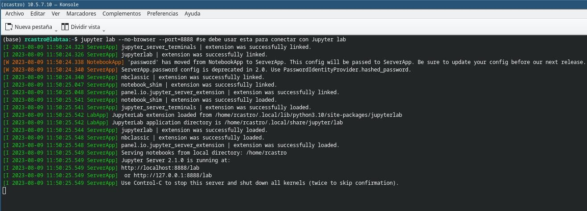
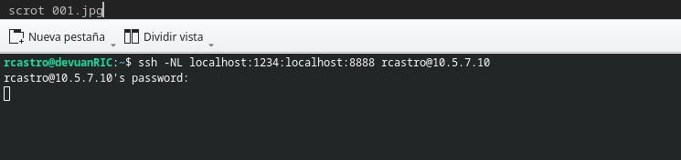
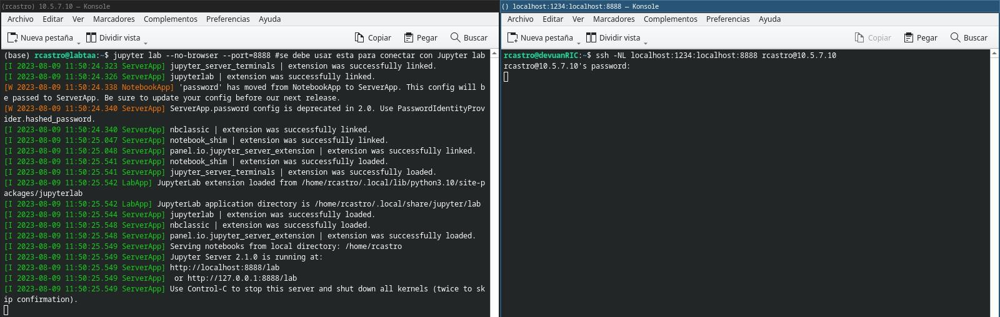
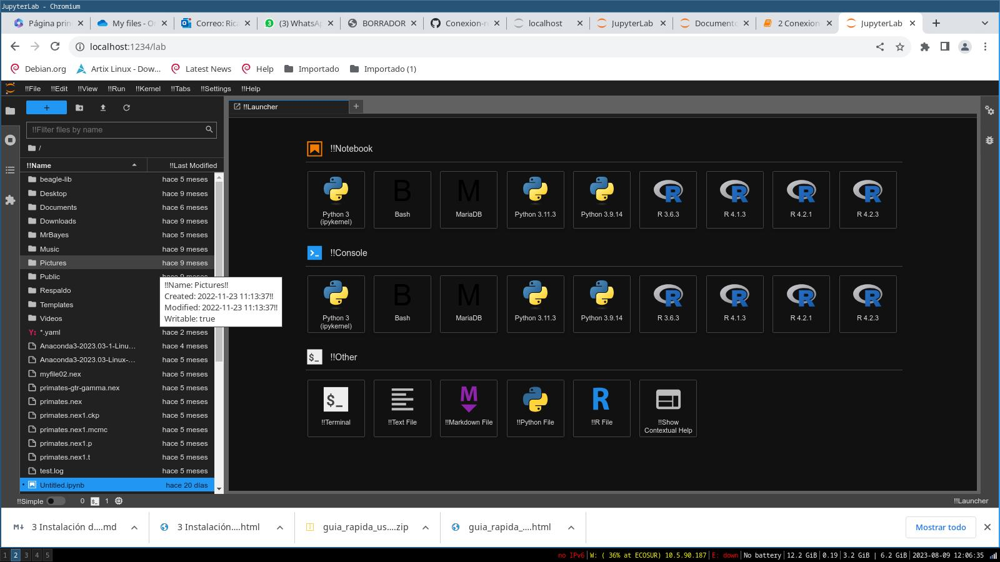
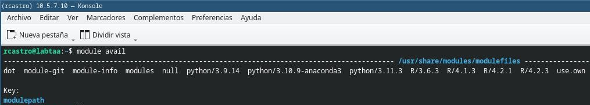
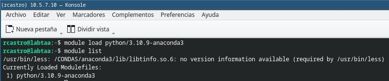
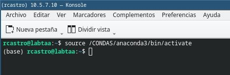

## Realizando la conexión a un servidor remoto desde terminal

Al nombre de usuario que de manera convencional se le llamará *user*

Los comandos de este turorial son para ser utilizados directamente desde la terminal, no desde Jupyter, si en algún momento se requiere el uso de software, se le indicará en el texto.

Por convención se entiene:

__Terminal, computadora o recurso local__: *Es aquel que sólo afecta a la computadora, sin haber establecido conexión con el servidor. (o máquina local)*

__Terminal, computadora o recurso remoto__: *Es aquel que afecta al servidor, es cuando ya se encuentra conectado o se hace referencia al servidor.*


Si asumimos que el servidor tiene como dirección ip: *__192.168.8.1__*, el ususario debera usar esa dirección en una terminal con ssh (asumiendo que tiene instalado ssh en la __Computadora Local__).

Si no tiene instalado ssh __Computadora Local__, se puede instalar mediante el comando a continuación.

_**nota: Todo lo que vaya posterior al un símbolo de "#" será ignorado y tratado como comentario**_


```python
sudo apt-get install openssh-server openssh-client openssh #ejecute si requiere instalar
```

Una vez instalado ssh, se estable ce la conexcion al servidor mediante el usuario y pass asignado:


```python
ssh user@192.168.8.1 #No corra este comando en Jupyter
```

El comando anterio es para conectarse al sevidor remoto desde la terminal de un equipo local, posterior a ello, pedirá un password

_**nota: Se debe eiminar el símbolo "#" que se encuentra al inicio del comando para que la terminal lo reconozca, todo lo que vaya posterior al un símbolo de "#" será ignorado**_ 

El comando "_passwd_" sólo ejecuta si es la primera vez con el servidor

El comando passwd es para cambiar el password asignado, generalmente es solo para la primera vez que se conecta a un servidor, porque por lo común, los usuarios no tienen permisos de root

Una vez intriducido el password aparecerá algo similar a esto:


## Conexion remota a servidor vía Jupyter

Una vez insalados todos los paquetes a utilizar, el trabajo se realiza mediante Jupyter


__Nota: Todo lo que se indica en este punto debe realizarse en terminal, salvo que se indique lo contrario__

1. Desde la tertminal de la distribución GNU/Linux o WSL de la computadora local se escribe lo siguiente para loguearse:

__**Nota: use la dirección ip de su servidor**__


```python
ssh user@192.168.8.1 #EL USER DEBE SER EL PROPIO
```

2. Se loguea con password (a partir de este punto su ejeuión de terminal se convierte en __remota__)

__Nota: Antes de pasar al paso 3 se debe activar anaconda con environment modules (ver el último avartado)__

3. En el servidor remoto se debe una de las ordenes dependiendo de si desea ejecutar "jupyter lab" o "jupyter notebook":


```python
jupyter lab --no-browser --port=8888 #se debe usar esta para conectar con Jupyter lab
#jupyter notebook --no-browser --port=8888 #se debe usar esta para conectar con Jupyter notebook
```



La orden anterior permitirá que Jupyter establezca una conexion remota con el servidor, pero no abrirá una ventana en el explorador de internet

4. __Sin cerrar la terminal anterior__, abra una segunda terminal de la maquina local:

5. En la segunda terminal ejecute lo siguiente:


```python
ssh -NL localhost:1234:localhost:8888 user@192.168.8.1
```

La segunda terminal le pedirá un pasword, en este punto la maquina local ya está conectada al servidor remoto por Jupyter 

La segunda terminal se verá así:




__Nota: No se debe cerrar ninguna de las dos ventanas en ejecución__


6. Abra en su equipo local el explorador de internet de su preferencia y pegue la dirección:

http://localhost:1234


__**Nota: El puerto local del servidor remoto que esta ud utilizando en el ejemplo es el puerto 1234, sólo acepta un usuario por puerto, puede conectarse con algún otro puerto si este esta ocupado.**__


Si el puerto que ud. usó es otro, entonces la dirección del localhost debe tener el numero del puerto de su selección, si ud usa:

>ssh -NL localhost:1111:localhost:8888 user@192.168.8.1


Entonces ud debe usar en su explorador 

>http://localhost:1111


7. Congratulaciones, en este punto ya debe estar conectado al servidor por Jupyter notebook o lab



Todo los que se ejecute o guarde en el Jupyter lab en este punto, afecta al servidor remoto

# Environment modules

El servidor remoto no puede tener los paquetes precargados, sino más bien se cargan por usuario.


La orden para ver los modulos instalados es:

>module avail




para cargar anaconda previo a trabajar lo primero que debemos hacer es cargar los modulos de anaconda en el servidor y eso se realiza mediante

>module load "nombre del paquete"

En este caso el paquete se llama python/3.10.9-anaconda3

Puede notar que cuando se introduce el comando module avail hay otras versiones de python y R como paquetes que tambien pueden ser cargados en caso de ser requeridos.




Por ultimo hay que activar anaconda con:

>source /CONDAS/anaconda3/bin/activate

Esta es la ruta donde se encuentra instalado anaconda.

Cuando la distribución de anaconda se ha activado en la terminal aparecerá el parentesis *(base)* antecendiendo a su usuario.




```python

```
