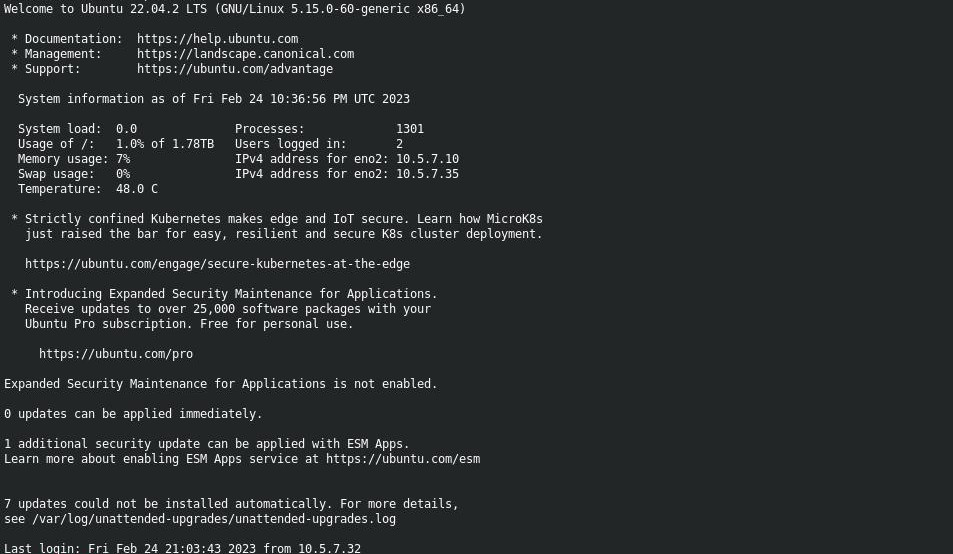

# Guía rápida para el uso del servidor


## El preámbulo


El tutorial a continuación aporta la información básica para poder conectarse y trabajar de manera remota a un servidor mediante [ssh](https://www.openssh.com/) desde una terminal local, esto significa que se interactuará a travez de interfaz de línea de comandos (CLI *por sus siglas en ingles*), sin interfáz gráfica.


En apoyo a la trazabilidad se implementará el uso de [Jupyter](https://jupyter.org/) lab o notebook, esto con la finalidad de que se utilice como bitácora de trabajo y para compartír codigo. 

Jupyter es una comunidad de gente entusiasta con el manejo de datos y que cree en los estándares de educación y herramientas de acceso abierto. Para ver más, visite la página de de [Jupyter](https://jupyter.org/) en https://jupyter.org/.

%%python3# import image module
from IPython.display import Image

## Interacción con el servidor


## mover archivos dentro del portatil o del servidor
### Copiar, comando __*cp*__, equivalente a copiar y pegar

*para archivos*:


```python
cp PATH_archivo_origen PATH_archivo_destino
```

*para carpetas*


```python
cp -R PATH_carpeta__origen PATH_carpeta_destino # es reiterativo para que copie todo el contenido interno
```

### Ingresar a rutas y salir de ellas

se puede usar *cd ~/*  y la carptera deolverá a /home/user

*Para ingresar*


```python
cd RUTA_DESTINO
```

para *salir* e ir una carpeta arriba


```python
cd ..
```

### Ver la ruta de trabajo actual


```python
pwd
```

### Ver contenido de una ruta en una lista


```python
ls # ya sea en la ruta actual o en una ruta específica|
```

### Crear y borrar archivos y directorios


__Nota: ya sea para copiar o borrar, en caso de los directorios debe usarse -R para que sea reiterativo__


```python
mkdir NOMBRE_DIRECTORIO # Crea un directorio
```


```python
rm -R NOMBRE_DIRECTORIO # Remueven directorio con contenido
```


```python
rm archivo,txt # Remueve un archivo de nombre archivo.txt
```


```python
man ls #llama al manual de cualquier programa, como ls
```

### Otros

Limpiar la terminal puedehacerse mediante
<kbd>Alt</kbd> + <kbd>L</kbd>

## Transferir archivos


Esto se puede realizar mediante el programa *scp*, que en realidad sigifica secure copy


```python
man scp #nos muestra el manual de scp
```

Dado que un comando tiene cierta estructura:
    
    comando <opciones> <parámetro1> <parámetro2> ...

*scp* se gestiona desde el recurso en el cual se haya la terminal interactuando.

Si la terminal se encuentra conectada al servidor, entonces scp se puede usar


```python
scp [options] origen destino
```

donde origen es el archivo que quiere copiar y destino es la ruta a donde lo va a copiar, por ejemplo,

si asumimos que el servidor tiene ip 192.168.8.1, entonces para copiar un archivo de nuestr amaquina al servidor pondremos:


```python
scp archivo_local user@192.168.8.1:/home/user/PATH_destino/archivo
```


```python
scp user@192.168.8.1:/home/user/PATH_destino/archivo PATH_local/archivo_local
```

__Nota: Si usa la opción -R puede ejecutarse sobre directorios__

## El primer contacto

Al nombre de usuario que de manera convencional se le llamará *user*

Los comandos de este turorial son para ser utilizados directamente desde la terminal, no desde Jupyter, si en algún momento no es así, se le indicará.

Por convención se entiene:

__Terminal, computadora o recurso local__: *Es aquel que sólo afecta a la computadora, sin haber establecido conexión con el servidor. (o máquina local)*

__Terminal, computadora o recurso remoto__: *Es aquel que afecta al servidor, es cuando ya se encuentra conectado o se hace referencia al servidor.*


Si asumimos que el servidor tiene como dirección ip: *__192.168..8.1__*, el ususario debera usar esa dirección en una terminal con ssh (asumiendo que tiene instalado ssh en la __Computadora Local__).

Si no tiene instalado ssh __Computadora Local__, se puede instalar mediante el comando a continuación.

_**nota: Todo lo que vaya posterior al un símbolo de "#" será ignorado y tratado como comentario**_


```python
sudo apt-get install openssh-server openssh-client openssh #ejecute si requiere instalar
```

Una vez instalado ssh, se estable ce la conexcion al servidor mediante el usuario y pass asignado:


```python
ssh user@10.5.7.10 #No corra este comando en Jupyter
```

El comando anterio es para conectarse al sevidor desde la terminal

_**nota: Se debe eiminar el símbolo "#" que se encuentra al inicio del comando para que la terminal lo reconozca, todo lo que vaya posterior al un símbolo de "#" será ignorado**_ 


```python
#passwd #sólo ejecute si es la primera vez con el servidor
```

Al entrar al servidor aparecerá algo similar:



__Nota: Todo lo que realizará a continuación sera con conexión remota en terminal WSL o GNU/Linux (logeado por ssh en el servidor):__

El servidor generalmente GNU/Linux ya viene con Jupyter notebook y lab nativo instalado, pero la instalación de anaconda se almacena en  en el __$HOME__ de cada ususario y no en el sistema, entonces las instalacione remotas de anaconda en servidores se deben realizar por los usuarios, a menos que se indique lo contrario.

Se describen los pasos a continuación:


1. Primero en el explorador de internet de la __maquina local__ se abre la pagina de [anaconda](https://www.anaconda.com/products/distribution#Downloads) y se busca la última versión:  
https://www.anaconda.com/products/distribution#Downloads

2. Enla sección de descargas, se seleccina el paquete a instalar, si el servidor es GNU/Linux, entonces la versión a instalar es de linux, se copia la dirección de enlace y se pega en la __terminal remota__ del servidor con click derecho sobre el ícono __64-Bit (x86) Installer (737 MB)__ y precedido por el comando __*wget*__, por ejemplo:


```python
wget https://repo.anaconda.com/archive/Anaconda3-2022.10-Linux-x86_64.sh
```

3. Se introduzce el comando __"ls"__ para listar archivos y ver si se descargo el archivo instalador con extensión **_*.sh_**:


```python
ls
```

4. Es probable que encuentre un archivo como __Anaconda3-2022.10-Linux-x86_64.sh__ entre los archivos, entonces se ejecutael instalador mediante:


```python
sh Anaconda3-2022.10-Linux-x86_64.sh
```

5. Las instrucciones del instalador, guían al usuario:

- Se debe aceptar la licencia escribiendo "*yes*" cuando se solicite.

- Se debe aceptar con enter o intro cuando el instaladorpide confirmar el directorio de instalación /home/user

- Se debe escribir "*yes*" al final de la instalación cuando el instalador pregunta si quiere ejecutar conda init para inicioa automático de anaconda


6. Salga del servidor con la finalidad de reiniciarlo escribiendo:


```python
exit
```

En la terminal antes de la insalación se ve así: 
__user@labtaa__

7. Posterior a la instalación de anaconda al conectarse al servidor, en la ventana aparecerá __(base)__ junto al nombre del ususario:

__(base)user@labtaa__

8. Se confirma que la instalación de anaconda revisando los ambientes;


```python
conda info --envs
```

En los servidores con GNU/Linux ya traen preinsalado python y pueden traer Jupyter, la distribución de anaconda también traje jupyter, siempre y cuando se haya instalado anaconda y no una versión minimalista de la como conda, pero se puede confirmar si en la instalación hay Jupyter mediante la revisión de cual jupyter hay en el sistema.


- Primero, se desactiva anaconda mediante:


```python
conda deactivate
```

- Segundo, se confirma que existe un python nativo mediante:


```python
which python # Esto muestra la ruta de instalación nativa de Python
python --version# Esto muestra la versión nativa de Python
```


```python
which Jupyter #Esto muestra la ruta de instalación nativa de Jupyter
jupyter --version # Esto muestra la versión nativa de Jupyter
```

- Tercero, se activa anaconda de nuevamente mediante:


```python
conda activate
```

- Con anaconda activo, se vuelve a correr:


```python
which python # Esto muestra la ruta de instalación nativa de Python
python --version# Esto muestra la versión nativa de Python
```


```python
which Jupyter #Esto muestra la ruta de instalación nativa de Jupyter
jupyter --version # Esto muestra la versión nativa de Jupyter
```

9. Se deben crear ambientes en donde realicen las intalaciones de anaconda de acuerdo a las necesidades de los usuarios

10. Fin del primer contacto

## Segundo contacto: Conectandose mediante Jupyter

Una vez insalados todos los paquetes a utilizar, el trabajo se realiza mediante Jupyter


__Nota: Todo lo que se indica en este punto debe realizarse en teminal, nada debe realizarse con Jupyter, salvo que se indique__

1. Desde la tertminal de la distribución GNU/Linux o WSL de la computadora local se escribe lo siguiente para loguearse:


```python
ssh user@10.5.7.10 #EL USER DEBE SER EL PROPIO
```

2. Se loguea con password (a partir de que se conecta, ya se convierte en __remoto__)

3. En el servidor remoto se debe ejecutar con "jupyter lab" o "jupyter notebook", según lo prefiera:


```python
jupyter lab --no-browser --port=8888 #se debe usar esta para conectar con Jupyter lab
#jupyter notebook --no-browser --port=8888 #se debe usar esta para conectar con Jupyter notebook
```

La orden anterior permitirá que Jupyter establezca una conexion remota con el servidor, pero no abrirá una ventana en el explorador de internet

4. __Sin cerrar la terminal anterior__, la cuál continuara ejecutando, se abre una segunda terminal de la maquina local y se conectese al servidor también mediante


```python
ssh user@10.5.7.10 #EL USER DEBE SER EL PROPIO
```

5. En esta segunda terminal y despues de haberse logueado en el servidor se escribe:


```python
ssh -NL localhost:1234:localhost:8888 user@10.5.7.10
```

En este punto la maquina local ya está conectada al servidor por Jupyter __Nota: No se debe cerrar ninguna de las dos ventanas en ejecución__

6. En la barra de direccionees del explorador de internet de la maquina local y se pega la siguiente en la dirección:


http://localhost:1234

7. Congratulaciones, debe haber conexion al servidor por Jupyter notebook o lab

Todo los que se ejecute o guarde en el Jupyter lab en este punto, afecta al servidor remoto
