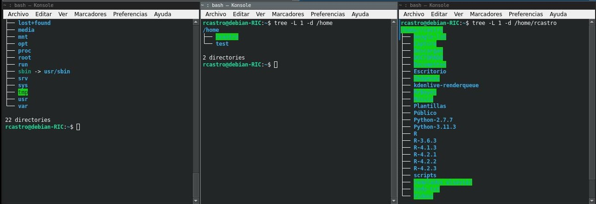

# Guía rápida para el uso del servidor


## Conociendo el sistema GNU/Linux


El tutorial a continuación aporta la información básica para poder conectarse y trabajar de manera remota a un servidor mediante [ssh](https://www.openssh.com/) desde una terminal local, esto significa que se interactuará a travez de interfaz de línea de comandos (CLI *por sus siglas en ingles*), sin interfáz gráfica.


En el presente tutorial se promueve el uso de Jupyter [lab](https://jupyterlab.readthedocs.io/en/stable/), jupyter [notebook](https://ebac.mx/blog/jupyter-notebook), ambas son plataformas informaticas interactictibas basadas en web adoptadas por el proyecto [Jupyter](https://jupyter.org/). Tango lab y notebook se pueden usar como bitácora de trabajo y para compartír codigo, de la misma manera se puede usar a [RStusio](https://posit.co/download/rstudio-desktop/) y [quarto](https://quarto.org/) como bitácora local de jupyter.

[Jupyter](https://jupyter.org/) es un sistema de publicación científica y técnica de código abierto para varios leguajes de programación con licencia BSD, _"libre"_ y _"gratuita"_. [Jupyter](https://jupyter.org/) es también una comunidad de gente entusiasta en manejo de datos que cree en los estándares de educación y herramientas de acceso abierto. Para mayor información, visite la página de de [Jupyter](https://jupyter.org/) en https://jupyter.org/.


## La cadena de conexión


## Organizacion de directorios del sistema en GNU/Linux y gestión de archivos

Los servidores en general, en su mayoría, traen distribuciones GNU/Linux, entonces primero hay que conocer la estructura de directorios de este tipo de distribuciones.

Como se sabe en GNU/Linux las rutas están construidas un poco diferente a como es en Windows, todo empieza desde la raíz (_"root"_) que se escribe con el símbolo <kbd>/</kbd>, dentro del directotio raíz hay varios directorios del sistema acompañado de 1 directorio de usarios de nombre  <kbd>/home</kbd> y dentro del directorio de usuarios está el directorio con los documentos de cada usuario  <kbd>/home/username</kbd>, tal y como se muestra en la imagen a continuación.




*para carpetas*

## mover archivos


### _*cp*_

Primero hay que saber que la acción de  _**mover**_ y _**transferir**_ no son lo mismo, transferir consiste de la gestion de archivos y directorios de un equipo local a uno remoto y viceversa.

El comando _**cp**_ es equivalente a copiar y pegar en una sola acción y en esta única acción hay que definir las rutas completas de origen y destino de los archivos a copiar.

Si escribimos el comando man y la orden cp en la terminal, nos dirá como utilizar. man está disponible para muchos de los programas de bash.


```bash
man cp
```


    CP(1)			      Órdenes de usuario			 CP(1)
    
    NOMBRE
           cp - copia archivos y directorios
    
    SINOPSIS
           cp [OPCIÓN]... [-T] ORIGEN DEST
           cp [OPCIÓN]... ORIGEN... DIRECTORIO
           cp [OPCIÓN]... -t DIRECTORIO ORIGEN...
    
    DESCRIPCIÓN
           Copia ORIGEN en DESTINO, o diversos ORÍGEN(es) a un directorio.
    
           Los  argumentos	obligatorios  para  las	 opciones  largas  son también
           obligatorios para las opciones cortas.
    
           -a, --archive
    	      igual que -dR --preserve=todo
    
           --attributes-only
    	      no copia los datos de los archivos, sólo sus atributos
    
           --backup[=CONTROL]
    	      crea una copia de seguridad de cada archivo de  destino  que  ya
    	      exista
    
           -b     como --backup pero no acepta ningún argumento
    
           --copy-contents
    	      en  modo	recursivo,  copia  también  el	contenido  de archivos
    	      especiales
    
           -d     igual que --no-dereference --preserve=enlaces
    
           -f, --force
    	      Si no puede abrirse un archivo  de  destino,  lo	elimina	 y  lo
    	      reintenta (esta opción se anula si también está definida -n).
    
           -i, --interactive
    	      avisa antes de sobreescribir (anula la opcion -n)
    
           -H     sigue los enlaces simbólicos en ORIGEN
    
           -l, --link
    	      crea enlaces duros en lugar de copiar
    
           -L, --dereference
    	      sigue siempre los enlaces simbólicos en FUENTE
    
           -n, --no-clobber
    	      no sobreescribe un archivo existente (anula la opción -i)
    
           -P, --no-dereference
    	      nunca sigue enlaces simbólicos en ORIGEN
    
           -p     igual que --preserve=modo,propietario, marca de tiempo
    
           --preserve[=ATTR_LIST]
    	      mantiene	 los   atributos  especificados	 (por  defecto:	 modo,
    	      propietario y marcas de tiempo), también otros  si  es  posible:
    	      contexto, enlaes, xatrr, todo
    
           --no-preserve=ATTR_LIST
    	      no mantiene los atributos indicados
    
           --parents
    	      emplea el nombre completo de la ruta en DIRECTORIO
    
           -R, -r, --recursive
    	      copia directorios de forma recursiva
    
           --reflink[=CUANDO]
    	      controla un clonado (Copy on write) optimizado. Vea más adelante
    
           --remove-destination
    	      elimina  los  archivos de destino antes de intentar abrirlos (al
    	      contrario que --force)).
    
           --sparse=CUANDO
    	      controla la creación de archivos con 'huecos'. Vea más adelante
    
           --strip-trailing-slashes
    	      elimina la barra al final de cada argumento de ORIGEN
    
           -s, --symbolic-link
    	      crea enlaces simbólicos en lugar de copiar
    
           -S, --suffix=SUFIJO
    	      reemplaza el sufijo de respaldo habitual
    
           -t, --target-directory=DIRECTORIO
    	      copia todos los argumentos ORIGEN al DIRECTORIO
    
           -T, --no-target-directory
    	      trata DESTINO como fichero normal
    
           -u, --update
    	      realiza la copia sólo so ORIGEN es más reciente que DESTINO o si
    	      no existe este DESTINO
    
           -v, --verbose
    	      explica lo que va haciendo
    
           -x, --one-file-system
    	      permanece en ese sistema de archivos
    
           -Z     define  el  contexto  de	seguridad  de  SELinux	del archivo de
    	      destino con el tipo por defecto
    
           --context[=CTX]
    	      como -Z, o si se especifica CTX entonces establece  el  contexto
    	      de seguridad SELinux o SMACK a CTX
    
           --help muestra la ayuda y finaliza
    
           --version
    	      muestra la versión del programa y termina
    
           Por  defecto,  los archivos con huecos ('sparse files') se detectan con
           un mecanismo heurístico muy básico creándose el archivo DESTINO también
           con  esa	 característica	 si  se	 define	 --sparse=auto.	 Si  se define
           --sparse=always se creará un archivo con huecos	siempre	 y  cuando  el
           ORIGEN  contenga	 una  secuencia	 de  ceros  los suficientemente larga.
           Emplee --sparse=never para evitar la creación de dichos archivos.
    
           Cuando se  define  --reflink[=always],  se  hará	 un  copia  optimizada
           únicamente  de los bloques de datos que hayan sido modificados. Si esto
           no fuese posible, se produjese un error o si se define  --reflink=auto,
           se  hará	 una  copia  estándar. Emplee --reflink=never si quiere que se
           haga siempre una copia estándar.
    
           El sufijo de respaldo es '~', a menos que se establezca con --suffix  o
           con  SIMPLE_BACKUP_SUFFIX.  El  método  de  control de versión se puede
           seleccionar con la opción --backup o a través de la variable de entorno
           VERSION_CONTROL. Estos son los valores:
    
           none, off
    	      nunca  realiza  copias  de seguridad (incluso si se da la opción
    	      --backup)
    
           numbered, t
    	      crea copias de seguridad numeradas
    
           existing, nil
    	      numeradas si existen copias de seguridad numeradas,  simples  en
    	      caso contrario
    
           simple, never
    	      siempre crea copias de seguridad simples
    
           como  excepción,	 cp  crea  una	copia de seguridad de ORIGEN cuando se
           indican las opciones '--force' y '--backup' y ORIGEN y  DESTINO	tienen
           el mismo nombre para un archivo regular.
    
    AUTOR
           Escrito por Torbjorn Granlund, David MacKenzie y Jim Meyering.
    
    INFORMAR DE ERRORES
           Ayuda	     en		línea	      de	 GNU	    Coreutils:
           <https://www.gnu.org/software/coreutils/>
           Informe	     cualquier	     error	 de	   traducción	     a
           <https://translationproject.org/team/es.html>
    
    COPYRIGHT
           Copyright  ©  2020  Free Software Foundation, Inc. Licencia GPLv3+: GNU
           GPL versión 3 o posterior <https://gnu.org/licenses/gpl.html>.
           Esto es software libre: usted es libre de cambiarlo  y  redistribuirlo.
           NO HAY GARANTÍA, en la medida permitida por la legislación.
    
    VÉASE TAMBIÉN
           Documentación completa en <https://www.gnu.org/software/coreutils/cp>
           también	 disponible   localmente   ejecutando:	info  '(coreutils)  cp
           invocation'
    
    TRADUCCIÓN
           La traducción al español de esta	 página	 del  manual  fue  creada  por
           Marcos Fouces <marcos@debian.org>
    
           Esta  traducción	 es  documentación  libre;  lea	 la GNU General Public
           License	 Version   3   ⟨https://www.gnu.org/licenses/gpl-3.0.html⟩   o
           posterior  con  respecto	 a  las	 condiciones  de copyright.  No existe
           NINGUNA RESPONSABILIDAD.
    
           Si encuentra algún error en la traducción de esta  página  del  manual,
           envíe  un  correo  electrónico a debian-l10n-spanish@lists.debian.org>.
           ⟨⟩.
    
    GNU coreutils 8.32	      Septiembre de 2020			 CP(1)


### _cp_ 

#### Comando _cp_ aplicado a archivos

*para archivos la sintaxis debe ser como se muestra a continuación*:

<kbd>__cp__</kbd>    <kbd>__ORIGEN__</kbd>    <kbd>__DESTINO__</kbd>


```bash
cp /home/rcastro/001_000.jpg /home/rcastro/Imágenes/
```

Si yo ejecuto el comando escrito en la línea anterior, le estaría dando la orden a la terminal de copiar un archivo de la ruta /home/user/ a la ruta /home/user/Imágenes/, al poner el nombre y extension del archivo \*.jpg, sólo en el origen, entonces no se cambiará el nombre del archivo a copiar _001_000.jpg_.

### _cp_

#### Comando _cp_ aplicado a directorios

*para diectorios se requiere la opción _"-R"_ que en realidad signfica que el proceso sea reiterativo y la sintaxis debe ser como se muestra a continuación*:

<kbd>__cp__</kbd>    <kbd>__-R__</kbd> <kbd>__ORIGEN__</kbd>    <kbd>__DESTINO__</kbd>


```bash
cp -R PATH_ORIGEN PATH_DESTINO # es reiterativo para que copie todo el contenido interno
```

### cd

__Entrar y salir de directorios__

se puede usar *cd ~/*  y la terminal lo enviará a /home/user


```bash
cd ~/
```

    /home/rcastro


cd sirve para moverse entre directorios, si ud proporciona la ruta completa, este lo llevará a ella, revise que significa _ruta relativa_ y _ruta absoluta_ para poder tener una idea mas clara del uso del comando cd

La sintaxis es:


```bash
cd RUTA_DESTINO
```

para *ir* un nivel arriba escriba:


```bash
cd ..
```

para ir a /home/user escriba sólo  "cd"


```bash
cd
```

    /home/rcastro


### Ver la ruta de trabajo actual


```bash
pwd
```


    '/home/rcastro'


### Ver contenido de una ruta en una lista


cualquier cosa precedida por símbolo de \# es invisible para la terminal, puede usarlo para realizar anotaciones.


```bash
ls # ya sea en la ruta actual o en una ruta específica|
```

### Crear y borrar direcotrios y archivos


__Nota: ya sea para copiar o borrar, en caso de los directorios debe usarse -R para que sea reiterativo__


```bash
mkdir NOMBRE_DIRECTORIO # Crea un directorio
```


```bash
rm -R NOMBRE_DIRECTORIO # Remueven directorio con contenido
```


```bash
rm archivo,txt # Remueve un archivo de nombre archivo.txt
```


```bash
man ls #llama al manual de cualquier programa, como ls
```

### Otros comandos

Limpiar la terminal, esta tarea puede realizarse mediante
<kbd>Alt</kbd> + <kbd>L</kbd>

o ejecutando en la terminal:


```bash
clear
```

    

Estos son algunos de los comandos más comunes en la gestión de archivos y directorios en GNU/Linux


|_Comdando_|Acción|
|------------------|--------------------|
|_ls_|Visualizar listas de directorios y archivos|
|_cd_|Cambiar de directorio|
|_pwd_|Mostrar directorio de trabajo|
|_mkdir_|Crea directorio vacío|
|_rm_|Remover archivos y directorios|
|_cp_|Copiar direcotios o archivos|
|_mv_|Mover o renombrar archivos o directorios|
|_touch_|Crear o actualizar archivo de texto|
|_cat_|Visualizar todo el texto de archivo|
|_more_|Visualizar texto de archivo|
|_less_|Visaulizar texto de archivo |
|_head_|Visaulizar 10 primeras líneas de texto de archivo|
|_tail_|Visaulizar ultimas 10 lineas de texto de archivo|
|_man_|Muestra el manual de los comandos|


## Transferir archivos


Esto básicamente consiste de enviar, archivos de un recurso local a uno remoto.


### _scp_

Este comando, *scp*, requiere del origen y el destino en los equipos local y remoto, estas rutas servirán para gestionar los archivos mediante ssh y scp.

para indicar el manual debemos escribir _man scp_


```bash
man scp #nos muestra el manual de scp
```


    SCP(1)                    BSD General Commands Manual                   SCP(1)
    
    NAME
         scp — OpenSSH secure file copy
    
    SYNOPSIS
         scp [-346ABCpqrTv] [-c cipher] [-F ssh_config] [-i identity_file]
             [-J destination] [-l limit] [-o ssh_option] [-P port] [-S program]
             source ... target
    
    DESCRIPTION
         scp copies files between hosts on a network.  It uses ssh(1) for data
         transfer, and uses the same authentication and provides the same security
         as ssh(1).  scp will ask for passwords or passphrases if they are needed
         for authentication.
    
         The source and target may be specified as a local pathname, a remote host
         with optional path in the form [user@]host:[path], or a URI in the form
         scp://[user@]host[:port][/path].  Local file names can be made explicit
         using absolute or relative pathnames to avoid scp treating file names
         containing ‘:’ as host specifiers.
    
         When copying between two remote hosts, if the URI format is used, a port
         may only be specified on the target if the -3 option is used.
    
         The options are as follows:
    
         -3      Copies between two remote hosts are transferred through the local
                 host.  Without this option the data is copied directly between
                 the two remote hosts.  Note that this option disables the
                 progress meter and selects batch mode for the second host, since
                 scp cannot ask for passwords or passphrases for both hosts.
    
         -4      Forces scp to use IPv4 addresses only.
    
         -6      Forces scp to use IPv6 addresses only.
    
         -A      Allows forwarding of ssh-agent(1) to the remote system.  The de‐
                 fault is not to forward an authentication agent.
    
         -B      Selects batch mode (prevents asking for passwords or
                 passphrases).
    
         -C      Compression enable.  Passes the -C flag to ssh(1) to enable com‐
                 pression.
    
         -c cipher
                 Selects the cipher to use for encrypting the data transfer.  This
                 option is directly passed to ssh(1).
    
         -F ssh_config
                 Specifies an alternative per-user configuration file for ssh.
                 This option is directly passed to ssh(1).
    
         -i identity_file
                 Selects the file from which the identity (private key) for public
                 key authentication is read.  This option is directly passed to
                 ssh(1).
    
         -J destination
                 Connect to the target host by first making an scp connection to
                 the jump host described by destination and then establishing a
                 TCP forwarding to the ultimate destination from there.  Multiple
                 jump hops may be specified separated by comma characters.  This
                 is a shortcut to specify a ProxyJump configuration directive.
                 This option is directly passed to ssh(1).
    
         -l limit
                 Limits the used bandwidth, specified in Kbit/s.
    
         -o ssh_option
                 Can be used to pass options to ssh in the format used in
                 ssh_config(5).  This is useful for specifying options for which
                 there is no separate scp command-line flag.  For full details of
                 the options listed below, and their possible values, see
                 ssh_config(5).
    
                       AddressFamily
                       BatchMode
                       BindAddress
                       BindInterface
                       CanonicalDomains
                       CanonicalizeFallbackLocal
                       CanonicalizeHostname
                       CanonicalizeMaxDots
                       CanonicalizePermittedCNAMEs
                       CASignatureAlgorithms
                       CertificateFile
                       ChallengeResponseAuthentication
                       CheckHostIP
                       Ciphers
                       Compression
                       ConnectionAttempts
                       ConnectTimeout
                       ControlMaster
                       ControlPath
                       ControlPersist
                       GlobalKnownHostsFile
                       GSSAPIAuthentication
                       GSSAPIDelegateCredentials
                       HashKnownHosts
                       Host
                       HostbasedAuthentication
                       HostbasedKeyTypes
                       HostKeyAlgorithms
                       HostKeyAlias
                       Hostname
                       IdentitiesOnly
                       IdentityAgent
                       IdentityFile
                       IPQoS
                       KbdInteractiveAuthentication
                       KbdInteractiveDevices
                       KexAlgorithms
                       LogLevel
                       MACs
                       NoHostAuthenticationForLocalhost
                       NumberOfPasswordPrompts
                       PasswordAuthentication
                       PKCS11Provider
                       Port
                       PreferredAuthentications
                       ProxyCommand
                       ProxyJump
                       PubkeyAcceptedKeyTypes
                       PubkeyAuthentication
                       RekeyLimit
                       SendEnv
                       ServerAliveInterval
                       ServerAliveCountMax
                       SetEnv
                       StrictHostKeyChecking
                       TCPKeepAlive
                       UpdateHostKeys
                       User
                       UserKnownHostsFile
                       VerifyHostKeyDNS
    
         -P port
                 Specifies the port to connect to on the remote host.  Note that
                 this option is written with a capital ‘P’, because -p is already
                 reserved for preserving the times and modes of the file.
    
         -p      Preserves modification times, access times, and modes from the
                 original file.
    
         -q      Quiet mode: disables the progress meter as well as warning and
                 diagnostic messages from ssh(1).
    
         -r      Recursively copy entire directories.  Note that scp follows sym‐
                 bolic links encountered in the tree traversal.
    
         -S program
                 Name of program to use for the encrypted connection.  The program
                 must understand ssh(1) options.
    
         -T      Disable strict filename checking.  By default when copying files
                 from a remote host to a local directory scp checks that the re‐
                 ceived filenames match those requested on the command-line to
                 prevent the remote end from sending unexpected or unwanted files.
                 Because of differences in how various operating systems and
                 shells interpret filename wildcards, these checks may cause
                 wanted files to be rejected.  This option disables these checks
                 at the expense of fully trusting that the server will not send
                 unexpected filenames.
    
         -v      Verbose mode.  Causes scp and ssh(1) to print debugging messages
                 about their progress.  This is helpful in debugging connection,
                 authentication, and configuration problems.
    
    EXIT STATUS
         The scp utility exits 0 on success, and >0 if an error occurs.
    
    SEE ALSO
         sftp(1), ssh(1), ssh-add(1), ssh-agent(1), ssh-keygen(1), ssh_config(5),
         sshd(8)
    
    HISTORY
         scp is based on the rcp program in BSD source code from the Regents of
         the University of California.
    
    AUTHORS
         Timo Rinne <tri@iki.fi>
         Tatu Ylonen <ylo@cs.hut.fi>
    
    BSD                             August 3, 2020                             BSD


Dado que un comando tiene cierta sintaxis:
    
    comando <opciones> <parámetro1> <parámetro2> ...

*scp* se gestiona desde el recurso en el cual se haya la terminal interactuando.

Si la terminal se encuentra conectada al servidor, entonces scp se puede usar


```bash
scp [options] ORIGEN DESTINO
```

donde:

origen es el archivo que quiere copiar y destino es la ruta a donde lo va a copiar, por ejemplo:

#### _Enviar_

La operación a continuación la podríamos definir como enviar.

Si tenemos un servidor con dirección ip 192.168.8.1, entonces para copiar un archivo de un equipo local a uno remoto escribimos:


```bash
scp archivo_local user@192.168.8.1:/home/user/PATH_destino/archivo
```

#### _Importar_

Pero si lo que deseamos hacer es copiar un archivo del servidor remoto a la maquina local entonces lo que debemos ejecutar será algo similar a:


```bash
scp user@192.168.8.1:/home/user/PATH_destino/archivo PATH_local/archivo_local
```

El ejemplo anterior podríamos definirlo como importar.


__Nota: Si se incluye la opción -R  antes del origen, el proceso se convierte en reiterativo y puede ejecutarse sobre directorios__

## Realizando la conexión a un servidor remoto

Al nombre de usuario que de manera convencional se le llamará *user*

Los comandos de este turorial son para ser utilizados directamente desde la terminal, no desde Jupyter, si en algún momento se requiere el uso de software, se le indicará en el texto.

Por convención se entiene:

__Terminal, computadora o recurso local__: *Es aquel que sólo afecta a la computadora, sin haber establecido conexión con el servidor. (o máquina local)*

__Terminal, computadora o recurso remoto__: *Es aquel que afecta al servidor, es cuando ya se encuentra conectado o se hace referencia al servidor.*


Si asumimos que el servidor tiene como dirección ip: *__192.168.8.1__*, el ususario debera usar esa dirección en una terminal con ssh (asumiendo que tiene instalado ssh en la __Computadora Local__).

Si no tiene instalado ssh __Computadora Local__, se puede instalar mediante el comando a continuación.

_**nota: Todo lo que vaya posterior al un símbolo de "#" será ignorado y tratado como comentario**_


```bash
sudo apt-get install openssh-server openssh-client openssh #ejecute si requiere instalar
```

Una vez instalado ssh, se estable ce la conexcion al servidor mediante el usuario y pass asignado:


```bash
ssh user@192.168.8.1 #No corra este comando en Jupyter
```

El comando anterio es para conectarse al sevidor remoto desde la terminal de un equipo local, posterior a ello, pedirá un password

_**nota: Se debe eiminar el símbolo "#" que se encuentra al inicio del comando para que la terminal lo reconozca, todo lo que vaya posterior al un símbolo de "#" será ignorado**_ 

El comando "_passwd_" sólo ejecuta si es la primera vez con el servidor

El comando passwd es para cambiar el password asignado, generalmente es solo para la primera vez que se conecta a un servidor, porque por lo común, los usuarios no tienen permisos de root

Una vez intriducido el password aparecerá algo similar a esto:


__Nota: Todo lo que realizará a continuación sera con conexión remota a un servidor desde terminal WSL o desde terminal GNU/Linux (logeado por ssh en el servidor):__

Los servidores GNU/Linux ya viene con [python](https://www.python.org/doc/), [Jupyter](https://jupyter.org/)-[lab](https://jupyterlab.readthedocs.io/en/stable/) y [Jupyter](https://jupyter.org/)-[notebook](https://ebac.mx/blog/jupyter-notebook) nativo instalado, y muy probablemente también anaconda, pero si desea y puede hacer la instalación de anaconda, primero debe tener encuenta que se instala en su __$HOME__ y no en el sistema, entonces las instalacione remotas de anaconda en servidores se almacenan en el $HOME de los usuarios, se proporciona esta información en caso de que se anime arealizar la instalación de la distribución de anaconda.

En caso contrario, ya debe estar instalado en su sistema o debe cargarse con un gestor de carga de paquetes com Environment-modules.


Se dejan los pasos a seguir para la instalación de anaconda.

Se describen los pasos a continuación:


1. Primero en el explorador de internet de la __maquina local__ se abre la pagina de [anaconda](https://www.anaconda.com/products/distribution#Downloads) y se busca la última versión:  
https://www.anaconda.com/products/distribution#Downloads

2. Enla sección de descargas, se seleccina el paquete a instalar, si el servidor es GNU/Linux, entonces la versión a instalar es de linux, se copia la dirección de enlace y se pega en la __terminal remota__ del servidor con click derecho sobre el ícono __64-Bit (x86) Installer (737 MB)__ y precedido por el comando __*wget*__, por ejemplo:


```bash
wget https://repo.anaconda.com/archive/Anaconda3-2022.10-Linux-x86_64.sh
```

3. Se introduzce el comando __"ls"__ para listar archivos y ver si se descargo el archivo instalador con extensión **_*.sh_**:


```bash
ls
```

4. Es probable que encuentre un archivo como __Anaconda3-2022.10-Linux-x86_64.sh__ entre los archivos, entonces se ejecutael instalador mediante:


```bash
sh Anaconda3-2022.10-Linux-x86_64.sh
```

5. Las instrucciones del instalador, guían al usuario:

- Se debe aceptar la licencia escribiendo "*yes*" cuando se solicite.

- Se debe aceptar con enter o intro cuando el instaladorpide confirmar el directorio de instalación /home/user

- Se debe escribir "*yes*" al final de la instalación cuando el instalador pregunta si quiere ejecutar conda init para inicioa automático de anaconda


6. Salga del servidor con la finalidad de reiniciarlo escribiendo:


```bash
exit
```

En la terminal antes de la insalación se ve así: 
__user@servidor__

7. Posterior a la instalación de anaconda al conectarse al servidor, en la ventana aparecerá __(base)__ junto al nombre del ususario:

__(base)user@servidor__

8. Se confirma que la instalación de anaconda revisando los ambientes;


```bash
conda info --envs
```

En los servidores con GNU/Linux ya traen preinsalado python y pueden traer Jupyter, la distribución de anaconda también traje jupyter, siempre y cuando se haya instalado anaconda y no una versión minimalista de la como conda, pero se puede confirmar si en la instalación hay Jupyter mediante la revisión de cual jupyter hay en el sistema.


- Primero, se desactiva anaconda mediante:


```bash
conda deactivate
```

- Segundo, se confirma que existe un python nativo mediante:


```bash
which python # Esto muestra la ruta de instalación nativa de Python
python --version# Esto muestra la versión nativa de Python
```


```bash
which Jupyter #Esto muestra la ruta de instalación nativa de Jupyter
jupyter --version # Esto muestra la versión nativa de Jupyter
```

- Tercero, se activa anaconda de nuevamente mediante:


```bash
conda activate
```

- Con anaconda activo, se vuelve a correr:


```bash
which python # Esto muestra la ruta de instalación nativa de Python
python --version# Esto muestra la versión nativa de Python
```


```bash
which Jupyter #Esto muestra la ruta de instalación nativa de Jupyter
jupyter --version # Esto muestra la versión nativa de Jupyter
```

9. Se deben crear ambientes en donde realicen las intalaciones de anaconda de acuerdo a las necesidades de los usuarios

10. Fin del primer contacto

## Conexion a servidor remoto vía Jupyter

Una vez insalados todos los paquetes a utilizar, el trabajo se realiza mediante Jupyter


__Nota: Todo lo que se indica en este punto debe realizarse en terminal, salvo que se indique lo contrario__

1. Desde la tertminal de la distribución GNU/Linux o WSL de la computadora local se escribe lo siguiente para loguearse:

__**Nota: use la dirección ip de su servidor**__


```bash
ssh user@192.168.8.1 #EL USER DEBE SER EL PROPIO
```

2. Se loguea con password (a partir de este punto su ejeuión de terminal se convierte en __remota__)

3. En el servidor remoto se debe una de las ordenes dependiendo de si desea ejecutar "jupyter lab" o "jupyter notebook":


```bash
jupyter lab --no-browser --port=8888 #se debe usar esta para conectar con Jupyter lab
#jupyter notebook --no-browser --port=8888 #se debe usar esta para conectar con Jupyter notebook
```

La orden anterior permitirá que Jupyter establezca una conexion remota con el servidor, pero no abrirá una ventana en el explorador de internet

4. __Sin cerrar la terminal anterior__, abra una segunda terminal de la maquina local:

5. En la segunda terminal ejecute lo siguiente:


```bash
ssh -NL localhost:1234:localhost:8888 user@192.168.8.1
```

La segunda terminal le pedirá un pasword, en este punto la maquina local ya está conectada al servidor remoto por Jupyter 

__Nota: No se debe cerrar ninguna de las dos ventanas en ejecución__

6. Abra el explorador de internet de su preferencia y pegue la dirección:


http://localhost:1234

__**Nota: El puerto local del servidor remoto que esta ud utilizando en el ejemplo es el puerto 1234, sólo acepta un usuario por puerto, puede conectarse con algún otro puerto si este esta ocupado.**__

7. Congratulaciones, debe haber conexion al servidor por Jupyter notebook o lab

Todo los que se ejecute o guarde en el Jupyter lab en este punto, afecta al servidor remoto
